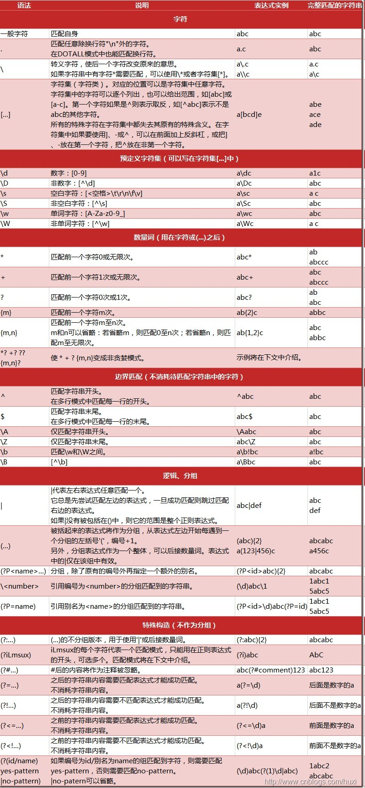

### 常用linux处理csv文件命令

train_data.csv文件在./data/目录下

```shell
# 查看csv文件有多少行
wc -l train_data.csv

more train_data.csv

# 查看前10行
head -10 train_data.csv

# 只查看某几列，例如查看第2列和第4列 -d 分隔符
cat train_data.csv | cut -f2,4 -d"," | more

# awk基本用法

# 分割大文件 -l 每个文件10000行；-d 表示切割后的文件以数字结尾；-a 表示后缀有几个数字占位
split -l 10000 -d -a 3 train_data.csv train_data.csv.

# 删除分割后的文件
rm train_data.csv.???
```


******

### 常用字符串操作

字符串操作.py 文件

--------------

### Python正则表达式

官方文档说明：[re — Regular expression operations — Python 3.11.5 documentation](https://docs.python.org/3/library/re.html)

中文文档说明：[正则表达式HOWTO — Python 3.11.5 文档](https://docs.python.org/zh-cn/3/howto/regex.html)

菜鸟教程：[Python 正则表达式 | 菜鸟教程 (runoob.com)](https://www.runoob.com/python/python-reg-expressions.html)

正则表达式在线验证工具之一是 http://regexr.com/

Python通过re模块提供对正则表达式的支持

使用re的一般步骤是：

+ 1.将正则表达式的字符串形式编译为Pattern实例
+ 2.使用Pattern实例处理文本并获得匹配结果（一个Match实例）
+ 3.使用Match实例获得信息，进行其他的操作。

**Python正则表达式.ipynb 文件**



----------

###  jieba中文处理

####  1.基本分词函数与用法

jieba.cut以及jieba.cut_for_search返回的结构都是一个可迭代的generator，可以使用for循环来获得分词后得到的每一个词语（Unicode）

**jieba.cut** 方法接受三个输入参数：

* 需要分词的字符串
* cut_all参数用来控制是否采用全模式
* HMM参数用来控制是否使用HMM模型

**jieba.cut_for_search** 方法接受两个参数

* 需要分词的字符串
* 是否使用HMM模型

该方法适合用于搜索引擎构建倒排索引的分词，粒度比较细

**jieba.lcut** 以及 **jieba.lcut_for_search** 直接返回 list

#### 2.关键词提取

**2.1 基于 TF-IDF 算法的关键词抽取**

import jieba.analyse

* jieba.analyse.extract_tags(sentence, topK=20, withWeigth=False,allowPOS=())
    * sentence为待提取的文本
    * topK为返回几个TF/IDF权重最大的关键词，默认值为20
    * withWeight 为是否一并返回关键词权重值，默认值为 False
    * allowPOS 仅包括指定词性的词，默认值为空，即不筛选

**关于TF-IDF算法的关键词抽取补充**

* 关键词提取所使用逆向文件频率（IDF）文本语料库可以切换成自定义语料库的路径
    * 用法： jieba.analyse.set_idf_path(file_name) # file_name为自定义语料库的路径
* 关键词提取所使用停止词（Stop Words）文本语料库可以切换成自定义语料库的路径
    * 用法： jieba.analyse.set_stop_words(file_name) # file_name为自定义语料库的路径

**2.2 基于TextRank算法的关键词抽取**

* jieba.analyse.textrank(sentence, topK=20, withWeight=False, allowPOS=('ns', 'n', 'vn', 'v')) 直接使用，接口相同，注意默认过滤词性。
  * ns表示地名、n表示名词、vn表示名动词、v表示动词
* jieba.analyse.TextRank() 新建自定义 TextRank 实例

基本思想:
* 将待抽取关键词的文本进行分词
* 以固定窗口大小(默认为5，通过span属性调整)，词之间的共现关系，构建图
* 计算图中节点的PageRank，注意是无向带权图

#### 3.词性标注

* jieba.posseg.POSTokenizer(tokenizer=None) 新建自定义分词器，tokenizer 参数可指定内部使用的 jieba.Tokenizer 分词器。jieba.posseg.dt 为默认词性标注分词器。
* 标注句子分词后每个词的词性，采用和 ictclas 兼容的标记法。

#### 4.并行分词

原理：将目标文本按行分隔后，把各行文本分配到多个 Python 进程并行分词，然后归并结果，从而获得分词速度的可观提升 基于 python 自带的 multiprocessing 模块，目前暂不支持 Windows
用法：
    jieba.enable_parallel(4) # 开启并行分词模式，参数为并行进程数
    jieba.disable_parallel() # 关闭并行分词模式
注意：并行分词仅支持默认分词器 jieba.dt 和 jieba.posseg.dt。